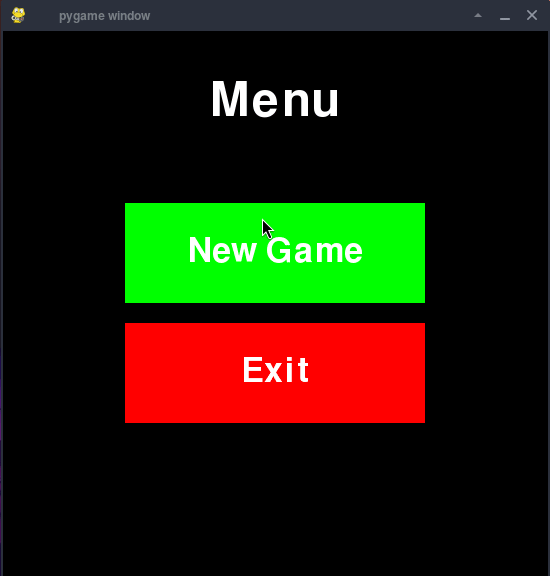

# Snake
Simple snake game buld with Python and Pygame

## Table of Contents
- [Gameplay](#gameplay)
- [Features](#features)
- [Technologies Used](#technologies-used)
- [Tested Platforms](#tested-platforms)
- [Getting Started](#getting-started)
- [Controls](#controls)
- [Licence](#licence)

## Gameplay


## Features
- Classic Snake gameplay
- Keyboard controls with WASD
- Random apple spawning outside the snake body
- Collision detection with walls and self
- Menu screen with start and exit actions
- Game over screen with return to menu and exit options
- Game configuration stored in JSON
- Layer-based architecture for game states and UI

## Technologies Used
- pygame-ce
- setuptools

## Tested Platforms
- Linux (Arch Linux)

## Getting Started
1. **Clone the repository:**
   ```bash
   git clone https://github.com/Driller34/Snake
   cd Snake
   ```
2. **Install:**
   ```bash
   python -m pip install --upgrade pip
   python -m pip install -e .
   ```

3. **Run:**
   ```bash
   pysnake
   ```

## Controls
- **W** → move up
- **S** → move down
- **A** → move left
- **D** → move right

## Licence
MIT